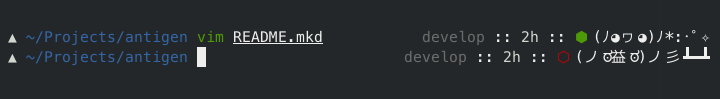

## Pretty git prompt

[Geometry](https://github.com/frmendes/geometry)'s prompt plugin from [here](https://github.com/frmendes/geometry/blob/master/plugins/README.md).

## Feedback

If you'd like to contribute to the project or file a bug or feature request, please visit
[the project page][1].

## License

The project is licensed under the [GNU GPL v3][2] license.

  [1]: https://github.com/desyncr/geometry-dir-info-prompt/
  [2]: http://www.gnu.org/licenses/gpl.html
